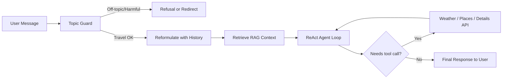
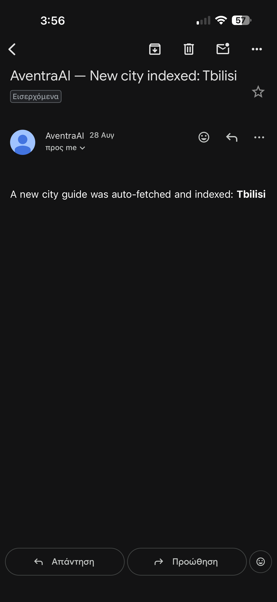

# AventraAI

AventraAI is a full-stack travel planning application powered by a conversational AI agent. Users describe where they want to go, and the system produces structured multi-day itineraries with daily activities, weather context, points of interest, flight and hotel links, and downloadable PDF plans. Beyond one-shot search, users can have open-ended travel conversations where the agent can look up live weather, search for places, and pull details from Google Maps on demand.

The project runs as a React single-page application served through Vercel, backed by a FastAPI service deployed on Render. The PostgreSQL database is hosted on Supabase. All travel knowledge is grounded in a Retrieval-Augmented Generation (RAG) pipeline built on Pinecone and OpenAI embeddings, fed by city guides sourced from Wikivoyage.

---

## Architecture

The system is organized into three layers: a React frontend, a FastAPI backend, and a set of external services that provide domain knowledge and infrastructure. The agent operates in two distinct modes, each with its own execution flow.

### Search Mode

When a user fills out the travel search form, the agent runs a deterministic pipeline that gathers all necessary context before making a single LLM call to generate the itinerary.


### Chat Mode

In chat, the agent operates as a ReAct loop. It has access to tools and RAG context, and can make multiple reasoning steps before responding. This is what differentiates it from a generic LLM chatbot: every response is grounded in live data from the same APIs and knowledge base used by the search pipeline.



When a user submits a search, the request flows through the agent pipeline: the destination is translated to English if needed, the RAG system is queried for relevant city knowledge, weather is fetched, places are resolved, and all of this context is assembled into a single prompt sent to the LLM. The model returns a structured JSON itinerary that gets persisted in PostgreSQL and rendered on the frontend.

For chat, the agent operates in a ReAct loop. It classifies incoming messages with a lightweight topic guard, reformulates follow-ups into standalone queries using conversation history, retrieves RAG context, and then reasons through tool calls (weather lookup, place search, place details) before producing a final text response. This is a deliberate design choice: the chat mode is not a thin wrapper around a generic LLM. Every conversational turn is grounded in the same RAG knowledge base and live API integrations used by the search pipeline. When a user asks "what's the weather like in Lisbon in March" or "find me a good restaurant near the Acropolis," the agent does not rely on the model's parametric memory alone -- it calls the actual weather and places APIs in real time and cross-references the city guide context from Pinecone. This makes the chat responses factually anchored to current data rather than dependent on whatever the base model happens to recall from its training set, which is what separates it from a general-purpose chatbot that simply generates plausible-sounding travel advice.

---

## Tech Stack

### Local vs Production

| Component | Local Development | Production |
|-----------|------------------|------------|
| Frontend | Vite dev server (localhost:5173) | Vercel (static SPA) |
| Backend | Uvicorn with --reload (localhost:8000) | Render (Docker, Uvicorn) |
| Database | PostgreSQL (local instance) | Supabase (managed PostgreSQL) |
| Vector Store | Pinecone (city-guides index) | Pinecone (city-guides index) |
| Embeddings | OpenAI text-embedding-3-small | OpenAI text-embedding-3-small |
| LLM | OpenAI GPT-4o-mini / GPT-4o | OpenAI GPT-4o-mini / GPT-4o |
| Observability | LangSmith (optional) | Sentry + LangSmith |

### Full Stack

| Layer | Technology |
|-------|-----------|
| Frontend | React 19, TypeScript, Vite, React Bootstrap, React Router, Axios |
| Backend | Python 3.12, FastAPI, SQLModel, Alembic, Pydantic Settings |
| Database | PostgreSQL (psycopg), hosted on Supabase in production |
| AI / LLM | LangChain, LangGraph, OpenAI GPT-4o and GPT-4o-mini |
| Embeddings | OpenAI text-embedding-3-small |
| Vector Store | Pinecone (city-guides index) |
| Authentication | JWT (HS256, Argon2 hashing), Google OAuth 2.0 |
| Payments | Stripe Checkout and Webhooks |
| Email | Resend |
| Observability | Sentry (FastAPI + SQLAlchemy tracing), LangSmith (optional) |
| Deployment | Vercel (frontend), Render with Docker (backend), Supabase (database) |
| PDF Generation | fpdf2 |

---

## RAG Pipeline and On-Demand Indexing

The knowledge base is built around city travel guides stored as markdown files. Each guide is sourced from Wikivoyage and covers sections like history, climate, things to see, food, nightlife, neighborhoods, and practical travel tips.

### How indexing works

Guides are split by markdown headers into semantically meaningful chunks (by city and section), embedded using OpenAI's `text-embedding-3-small` model, and upserted into a Pinecone index called `city-guides`. At retrieval time, the system pulls the top 5 most relevant chunks for a given query using similarity search, with results cached for 24 hours to reduce redundant calls.

### On-demand city guide fetching

This is where it gets interesting. The system does not require every city to be pre-indexed. When a user searches for a destination that has no local guide file, the pipeline automatically fetches the corresponding Wikivoyage article, filters it down to travel-relevant sections, truncates it to a reasonable length, writes it as a markdown file, and indexes it into Pinecone in real time. The user's search then proceeds with the freshly indexed knowledge, as if the city had always been part of the database.

This means the knowledge base grows organically based on actual user demand. Every new city a user asks about becomes permanently available for all future queries.

Whenever a new city is indexed on demand, the system sends an email notification with the city name so that new additions to the knowledge base are tracked without needing to check logs.



There is also a bulk indexing pipeline (under `backend/scripts/`) used for initial setup. It downloads guides for a curated list of major global destinations, cleans them, and indexes the full set into Pinecone in one pass.

### Current coverage

The knowledge base ships with approximately 105 pre-indexed city guides covering major destinations worldwide. Any city with a Wikivoyage article can be added on the fly through the on-demand mechanism described above.

### Caching strategy

RAG retrieval and external API calls are the two most expensive operations in the pipeline, both in terms of latency and cost. To keep these under control, the system uses TTL-based caching at multiple levels:

- **RAG results** are cached for 24 hours. If the same destination or a similar query comes up within that window, the system serves the cached chunks instead of making a new embedding call and Pinecone query. This avoids redundant OpenAI embedding costs and Pinecone read units for popular destinations that get searched repeatedly.

- **Google Places search results and place details** are cached for 24 hours. Place photos are cached for one hour (since photo URLs expire). This is significant because the Google Places API bills per request, and the same attractions and restaurants tend to come up across different users searching the same city.

- **Weather geocoding and forecast data** are cached similarly, which prevents repeated calls to Open-Meteo for the same location within a short timeframe.

The net effect is that the first search for a given city pays the full cost of all API calls, but subsequent searches within the cache window are served almost entirely from memory. For a destination like Paris or Tokyo that might get searched dozens of times a day, this translates to a substantial reduction in external API usage.

---

## Backend

The backend is a FastAPI application structured around a clear separation of concerns:

### Agent Pipeline (`app/agent/`)

The core intelligence of the application. The `TravelAgentPipeline` class exposes two main flows:

- **Search mode**: A deterministic pipeline that translates the destination, ensures RAG coverage, fetches weather from Open-Meteo, resolves IATA airport codes for Skyscanner links, queries Google Places for attractions and restaurants, and sends all collected context to the LLM with strict JSON output requirements. The model must return exactly one package with one itinerary entry per trip day and four activities per day.

- **Chat mode**: A ReAct-style agent built with LangGraph that can call weather, place search, and place detail tools. Messages go through a topic guard that rejects harmful content and redirects off-topic queries, and follow-up questions are reformulated into standalone queries using a lightweight contextualization step.

Free-tier users get `gpt-4o-mini` (fast, cost-effective). Paid users get `gpt-4o` (higher quality, better reasoning). Search uses a low temperature (0.2) for consistency; chat uses a higher temperature (0.7) for more natural conversation.

### Infrastructure Services (`app/agent/infrastructure/`)

- **Weather**: Uses Open-Meteo for geocoding and forecasts. For trips within 16 days, it uses the forecast API; for trips further out, it pulls historical data from the same dates one year prior. Returns min/max temperatures, precipitation, and weather descriptions.

- **Places**: Integrates with Google Places API (New) for text search, place details, and photos. Results are cached for 24 hours, photos for one hour.

- **Airport Codes**: Resolves city names to IATA codes using bundled OpenFlights data with manual overrides for edge cases. Used to construct Skyscanner deep links.

- **City Guide Fetcher**: The on-demand Wikivoyage integration described above. Includes email notification (via Resend) when a new city is indexed.

### API Routes (`app/api/routes/`)

- **Authentication**: Google OAuth flow and standard email/password login with JWT tokens. Password hashing uses Argon2 with a bcrypt verification fallback.
- **Travel**: Creates search sessions, runs the agent pipeline, enforces usage quotas (3 free / 20 paid searches per month), and generates PDF itineraries.
- **Chat**: Session management, message persistence, agent interaction, title generation, pin/rename/delete operations. Enforces 50 free / 500 paid messages per monthly period.
- **Users**: Registration, profile management, password updates, onboarding tracking, and superuser administration.
- **Payments**: Stripe Checkout session creation, subscription confirmation, cancellation at period end, and webhook handling for asynchronous Stripe events.

### Data Layer (`app/models.py`, `app/crud.py`)

The database schema covers users (with Google identity linking and subscription state), chat sessions and messages, search sessions, and a full travel package hierarchy (package, itinerary, activity, accommodation). Migrations are managed through Alembic.

---

## Frontend

The frontend is a React 19 single-page application built with TypeScript and Vite. It uses React Bootstrap for layout and styling, React Router for navigation, and Axios for API communication.

### Key Screens

- **Landing Page**: Product overview with plan comparison and rotating destination visuals.
- **Chat Page**: The main interface. Supports both free-form conversation and structured travel search through a toggleable form. Messages render with basic markdown support, and travel packages appear as interactive cards with PDF download. Responses are revealed progressively to simulate streaming.
- **Profile Page**: Displays usage quotas, subscription status, and allows profile editing and subscription cancellation.
- **Auth Pages**: Login, registration, password recovery, and Google OAuth.

### Notable Features

- **Voice input**: Browser-based speech recognition (English) is integrated into the chat input, allowing users to dictate messages.
- **Onboarding tour**: First-time users see a guided overlay highlighting the main UI elements.
- **Guest route handling**: Authenticated users are redirected away from login/register pages.
- **Simulated streaming**: The frontend progressively reveals complete API responses character by character to create a typing effect.

---

## Deployment

The frontend deploys to **Vercel** as a static SPA with a catch-all rewrite for client-side routing. The backend deploys to **Render** using a Docker image based on Python 3.12 slim, with `uv` as the package manager. The container runs Alembic migrations at startup and serves the application through Uvicorn on port 8000. The PostgreSQL database is hosted on **Supabase**, which provides a managed Postgres instance with connection pooling.

### Environment Variables

The backend requires configuration for:

- `DATABASE_URL` (PostgreSQL connection string)
- `OPENAI_API_KEY`
- `PINECONE_API_KEY`
- `GOOGLE_MAPS_API_KEY`
- `RESEND_API_KEY`
- `STRIPE_SECRET_KEY` and `STRIPE_WEBHOOK_SECRET`
- `GOOGLE_CLIENT_ID` and `GOOGLE_CLIENT_SECRET`
- `SECRET_KEY` (JWT signing)
- `SENTRY_DSN` (optional)

The frontend requires:

- `VITE_API_URL` (backend base URL)
- `VITE_GOOGLE_CLIENT_ID`

---

## Project Structure

```
backend/
  app/
    agent/               # AI pipeline, prompts, configuration
      infrastructure/    # Weather, places, airports, city guide fetcher
    api/
      routes/            # Auth, chat, travel, users, payments
    core/                # Config, database, security
    rag/                 # RAG service, ingestion, retrieval
      data/              # City guide markdown files
  scripts/               # Bulk fetching and indexing utilities
  tests/                 # Unit and integration tests

frontend/
  src/
    components/          # Reusable UI components
    context/             # React auth context
    hooks/               # Custom hooks (auth, speech recognition)
    pages/               # Route-level page components
    services/            # API client and auth service
```

---

## Development

### Backend

```bash
cd backend
uv sync
cp .env.example .env  # configure your keys
alembic upgrade head
uvicorn app.main:app --reload
```

### Frontend

```bash
cd frontend
npm install
npm run dev
```

### Running Tests

```bash
cd backend
pytest
```

### Bulk Indexing

To populate the knowledge base with the default city set:

```bash
cd backend
python scripts/fetch_city_guides.py
python scripts/run_indexer.py
```
